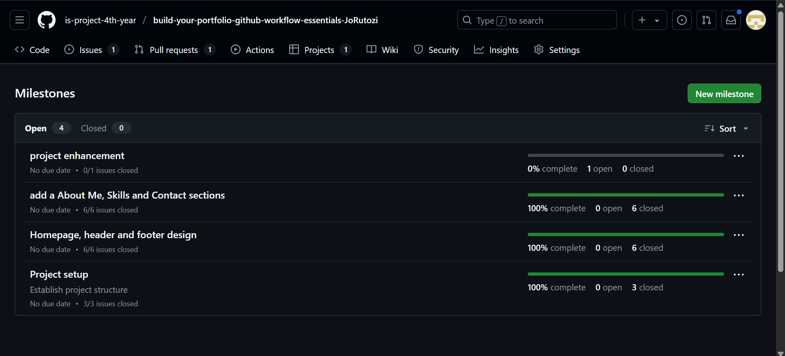
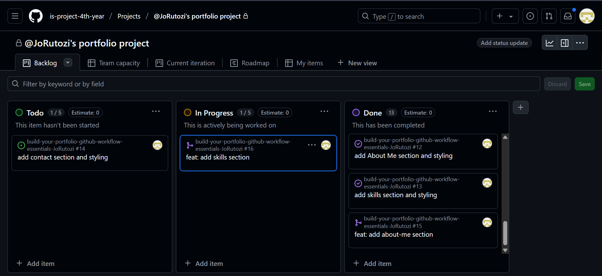
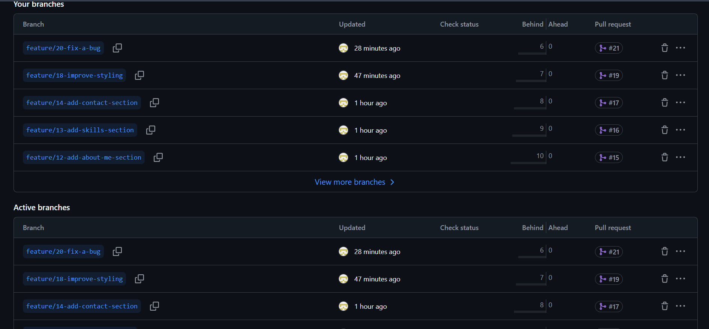
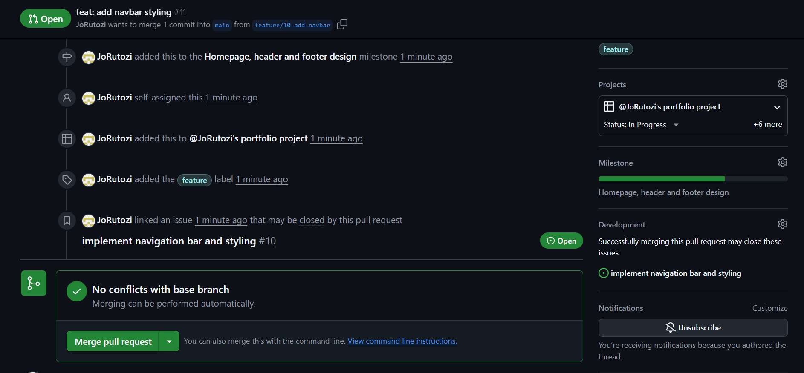
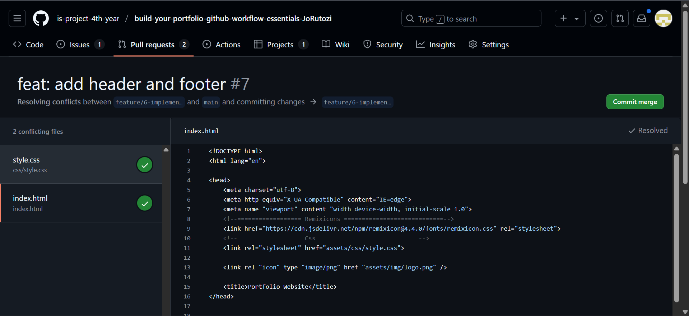

# Personal Portfolio Documentation

## 1. Student Details

- **Full Name**: Joey Shaloom Rutozi
- **GitHub Username**: JoRutozi
- **Email**: joey.rutozi@strathmore.edu

## 2. Deployed Portfolio Link

- **GitHub Pages URL**:  
https://is-project-4th-year.github.io/build-your-portfolio-github-workflow-essentials-JoRutozi/

## 3. Learnings from the Git Crash Program

-Project Board: I learned to manage milestones and issues for task tracking.
-Pull Request: I practiced collaboration with others and the use of meaningful titles and reviews.
-Git commit: I applied conventional commits for clearer version history and changelogs.
-Git merge and rebase: I explored Github merge strategies like merge and rebase to create a clean github workflow.

## 4. Screenshots of Key GitHub Features

Include screenshots that demonstrate how you used GitHub to manage your project. For each screenshot, write a short caption explaining what it shows.

> Upload the screenshots to your GitHub repository and reference them here using Markdown image syntax:
> (you could just simply copy and paste the image into the Assignment.md)

```markdown

```

### A. Milestones and Issues

- Screenshot showing your milestone(s) and the issues linked to it.

### B. Project Board

- Screenshot of your GitHub Project Board with issues organized into columns (e.g., To Do, In Progress, Done).

### C. Branching

- Screenshot showing your branch list with meaningful naming.

### D. Pull Requests

- Screenshot of a pull request that’s either open or merged and linked to a related issue.

### E. Merge Conflict Resolution

- Screenshot of a resolved merge conflict (in a pull request, commit history, or your local terminal/GitHub Desktop).
